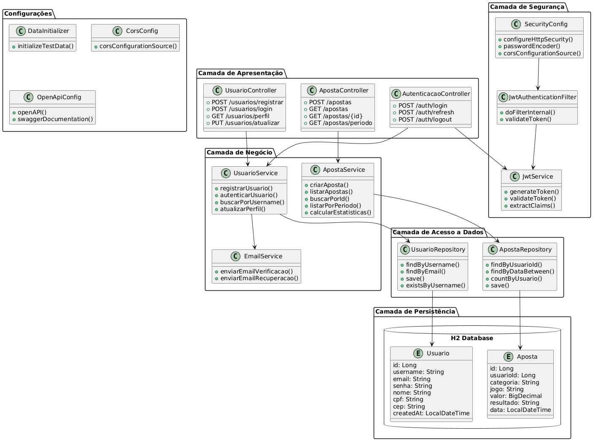
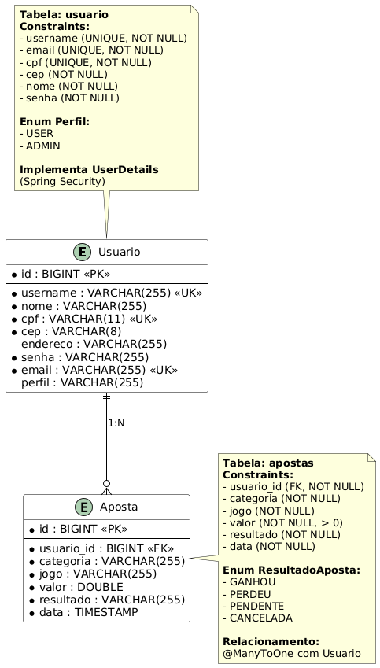
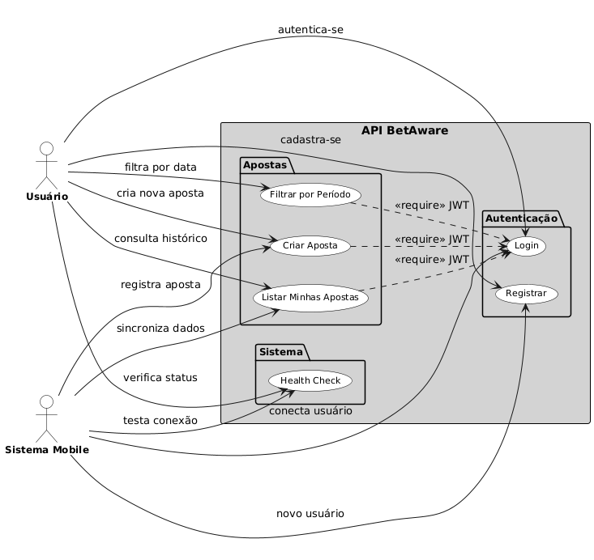

# Betaware - API de Gerenciamento de Apostas

## Sobre o Projeto
Betaware é uma plataforma, com o objetivo de conscientizar sobre os riscos das apostas esportivas. A plataforma permite que o usuário simule apostas fictícias, visualize relatórios detalhados de desempenho e acompanhe seu comportamento ao longo do tempo.

Esta API REST, desenvolvida em Spring Boot, serve como backend para a plataforma, fornecendo todas as funcionalidades necessárias para o gerenciamento seguro e eficiente das apostas simuladas, autenticação de usuários e geração de relatórios.

## Repositórios Relacionados

- **Aplicativo Mobile (React Native):** [https://github.com/pedrobicas/BetAwareApp](https://github.com/pedrobicas/BetAwareApp)
- **Aplicação Web (Angular):** [https://github.com/pedrobicas/BetAwareWeb](https://github.com/pedrobicas/BetAwareWeb)

## Tecnologias Utilizadas
- Java 17
- Spring Boot 3.x
- Spring Security
- JWT (JSON Web Token)
- JPA/Hibernate
- PostgreSQL
- Maven
- Swagger/OpenAPI

## Funcionalidades Principais
- Autenticação e autorização com JWT
- Registro e login de usuários
- Gerenciamento de apostas (criar, listar, filtrar)
- Filtros por período e usuário
- Validação de dados
- Tratamento de exceções
- Documentação com Swagger

## Estrutura do Projeto
```
src/main/java/com/example/betaware/
├── config/         # Configurações do projeto
├── controller/     # Controladores REST
├── dto/           # Objetos de transferência de dados
├── exception/     # Tratamento de exceções
├── model/         # Entidades do sistema
├── repository/    # Repositórios JPA
├── security/      # Configurações de segurança
└── service/       # Lógica de negócio
```

## Diagramas

### 🏗️ Arquitetura do Sistema
O projeto segue uma arquitetura em camadas bem definida (Presentation → Business → Data), com separação clara de responsabilidades e uso de padrões Spring Boot:


- **Presentation Layer**: Controllers REST com validação e DTOs
- **Security Layer**: JWT Authentication e Spring Security
- **Business Layer**: Services com regras de negócio
- **Data Access Layer**: Repositories JPA e entidades
- **Exception Handling**: Tratamento global padronizado

### 🗄️ Modelo de Entidades
Modelo de dados simplificado focado na funcionalidade core de apostas simuladas:


- **Usuario**: Implementa UserDetails para integração com Spring Security
- **Aposta**: Entidade principal com validações de negócio
- **Enums**: Perfil (ADMIN/USER) e ResultadoAposta (GANHOU/PERDEU/PENDENTE/CANCELADA)

### 📋 Casos de Uso
Principais fluxos funcionais da aplicação com foco na experiência do usuário:


- **Autenticação**: Registro e login com JWT
- **Gestão de Apostas**: CRUD completo com filtros
- **Administração**: Controles administrativos
- **Infraestrutura**: Health checks e documentação

## Endpoints Principais

### Autenticação
- POST `/v1/auth/register` - Registro de novo usuário
- POST `/v1/auth/login` - Login e obtenção do token JWT

### Apostas
- POST `/v1/apostas` - Criar nova aposta
- GET `/v1/apostas` - Listar apostas do usuário
- GET `/v1/apostas/periodo` - Listar apostas por período
- GET `/v1/apostas/usuario/periodo` - Listar apostas do usuário por período

### Health Check
- GET `/v1/health` - Verificar status da API

## Configuração do Ambiente

### Pré-requisitos
- Java 17 ou superior
- Maven
- PostgreSQL

### Configuração do Banco de Dados
1. Crie um banco de dados PostgreSQL
2. Configure as credenciais no arquivo `application.properties`

### Executando o Projeto
```bash
# Clone o repositório
git clone https://github.com/pedrobicas/BetAwareAPI.git

# Entre no diretório
cd BetAwareAPI

# Compile o projeto
mvn clean install

# Execute a aplicação
mvn spring-boot:run
```

## Documentação da API
A documentação completa da API está disponível através do Swagger UI:
- URL: `http://localhost:8080/swagger-ui.html`

## Equipe de Desenvolvimento
- Felipe Terra – RM 99405
- Pedro Bicas – RM 99534
- Gabriel Doms – RM 98630
- Lucas Vassão – RM 98607
- Bryan Willian – RM 551305

## Segurança
- Autenticação via JWT
- Senhas criptografadas com BCrypt
- Validação de dados
- Proteção contra CSRF
- Configuração CORS

## Contribuição
1. Faça o fork do projeto
2. Crie uma branch para sua feature (`git checkout -b feature/AmazingFeature`)
3. Commit suas mudanças (`git commit -m 'Add some AmazingFeature'`)
4. Push para a branch (`git push origin feature/AmazingFeature`)
5. Abra um Pull Request

## Licença
Este projeto está sob a licença MIT. Veja o arquivo `LICENSE` para mais detalhes. 
