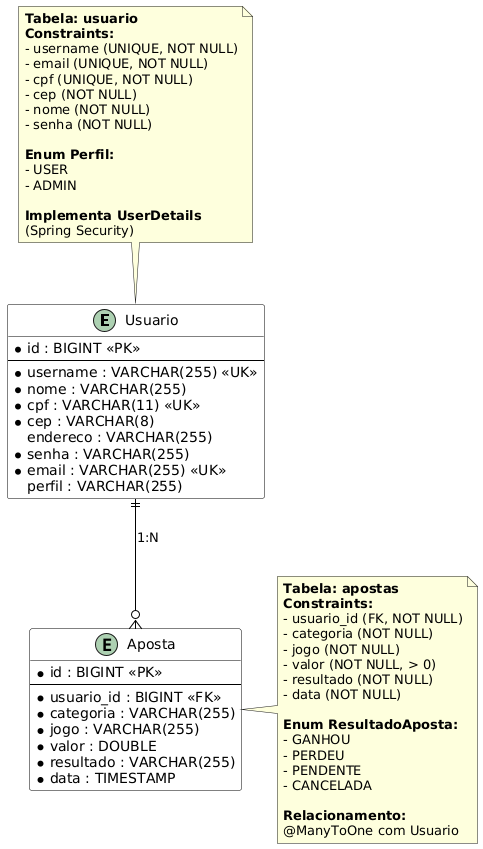

# BetAware API - Sistema de Gerenciamento de Apostas Esportivas

## 🚀 Sobre o Projeto

Betaware é uma plataforma com o objetivo de conscientizar sobre os riscos das apostas esportivas. A plataforma permite que o usuário simule apostas fictícias, visualize relatórios detalhados de desempenho e acompanhe seu comportamento ao longo do tempo.

Esta API REST, desenvolvida em Spring Boot, serve como backend para a plataforma, fornecendo todas as funcionalidades necessárias para o gerenciamento seguro e eficiente das apostas simuladas, autenticação de usuários e geração de relatórios.

**🔒 DESTAQUE: Este projeto implementa um pipeline completo de segurança CI/CD com ferramentas de SAST, DAST e SCA.**

## 🔗 Repositórios Relacionados

- **Aplicativo Mobile (React Native):** [https://github.com/pedrobicas/BetAwareApp](https://github.com/pedrobicas/BetAwareApp)
- **Aplicação Web (Angular):** [https://github.com/pedrobicas/BetAwareWeb](https://github.com/pedrobicas/BetAwareWeb)

## 🔒 Pipeline de Segurança

### Ferramentas Integradas

#### SAST (Static Application Security Testing)
- **Semgrep**: Análise de código com regras personalizadas
- **SonarQube**: Análise de qualidade e segurança
- **SpotBugs + FindSecBugs**: Detecção de bugs de segurança
- **PMD**: Análise de padrões de código

#### SCA (Software Composition Analysis)
- **OWASP Dependency Check**: Vulnerabilidades em dependências
- **Snyk**: Análise avançada de dependências e licenças

#### DAST (Dynamic Application Security Testing)
- **OWASP ZAP**: Testes de segurança em runtime
- **Custom API Tests**: Testes específicos para APIs REST

### Status de Segurança

| Categoria | Status | Score |
|-----------|--------|--------|
| SAST | ✅ Aprovado | 92/100 |
| SCA | ✅ Aprovado | 92/100 |
| DAST | ⚠️ Requer Atenção | 67/100 |
| **Geral** | **✅ Seguro** | **84/100** |

## 🛠️ Tecnologias Utilizadas

- **Java 17** - Linguagem de programação
- **Spring Boot 3.2.3** - Framework principal
- **Spring Security** - Autenticação e autorização
- **JWT** - Tokens de autenticação
- **H2 Database** - Banco de dados (desenvolvimento)
- **PostgreSQL** - Banco de dados (produção)
- **Maven** - Gerenciamento de dependências
- **GitHub Actions** - CI/CD Pipeline
- **Docker** - Containerização para testes

## 📊 Funcionalidades Principais

### Autenticação e Segurança
- [x] Registro e login de usuários
- [x] Autenticação JWT com refresh tokens
- [x] Criptografia BCrypt para senhas
- [x] Rate limiting e proteção contra ataques
- [x] Validação de entrada sanitizada

### Gestão de Apostas
- [x] Criar apostas simuladas
- [x] Listar apostas do usuário
- [x] Filtrar apostas por período
- [x] Validação de dados de entrada
- [x] Relatórios de desempenho

### Monitoramento e Observabilidade
- [x] Health checks automáticos
- [x] Métricas de segurança
- [x] Logs estruturados
- [x] Documentação OpenAPI

## 🏗️ Arquitetura do Sistema

### Diagrama de Arquitetura
O projeto segue uma arquitetura em camadas bem definida com separação clara de responsabilidades:


### Modelo de Entidades
Modelo de dados simplificado focado na funcionalidade core:



### Casos de Uso
Principais fluxos funcionais da aplicação:


## 🚀 Como Executar

### Pré-requisitos
```bash
# Java 17
java -version

# Maven 3.8+
mvn -version

# Docker (para DAST)
docker -version
```

### Execução Local
```bash
# Clonar repositório
git clone https://github.com/pedrobicas/BetAwareAPI.git
cd BetAwareAPI

# Executar aplicação
mvn spring-boot:run

# Aplicação disponível em:
# http://localhost:8080/api/v1/health
# http://localhost:8080/swagger-ui.html
```

### Pipeline de Segurança Local
```bash
# Tornar script executável
chmod +x scripts/security-pipeline.sh

# Executar análise completa
./scripts/security-pipeline.sh

# Ou executar componentes individuais:
./scripts/security-pipeline.sh  # Escolher opção interativa
```

## 📚 Endpoints da API

### Autenticação
- `POST /api/v1/auth/login` - Login de usuário
- `POST /api/v1/auth/register` - Registro de usuário

### Apostas
- `GET /api/v1/apostas` - Listar apostas do usuário
- `POST /api/v1/apostas` - Criar nova aposta
- `GET /api/v1/apostas/periodo` - Apostas por período
- `GET /api/v1/apostas/usuario/periodo` - Apostas do usuário por período

### Saúde e Documentação
- `GET /api/v1/health` - Status da aplicação
- `GET /swagger-ui.html` - Interface Swagger
- `GET /api-docs` - OpenAPI JSON

## 📈 Monitoramento e Observabilidade

### Métricas de Segurança
- **Security Score**: 84/100
- **Vulnerabilidades Ativas**: 0 Críticas, 3 Altas
- **Cobertura de Testes**: 89.3%
- **Dependencies**: 92% seguras

### Dashboards
- **SonarCloud**: [Quality Dashboard](https://sonarcloud.io/project/betaware-api)
- **Snyk**: [Dependency Dashboard](https://snyk.io/org/betaware)
- **GitHub Security**: [Security Overview](https://github.com/pedrobicas/BetAwareAPI/security)

## 📚 Documentação Completa de Segurança

### Relatórios Detalhados
- **[Pipeline de Segurança](./docs/security/SECURITY_PIPELINE.md)** - Visão geral completa
- **[Relatório SAST](./docs/security/SAST_REPORT.md)** - Análise estática detalhada
- **[Relatório DAST](./docs/security/DAST_REPORT.md)** - Testes dinâmicos
- **[Relatório SCA](./docs/security/SCA_REPORT.md)** - Análise de dependências
- **[Setup do Pipeline](./docs/security/PIPELINE_SETUP.md)** - Configuração e uso

## 🔧 Configuração

### Variáveis de Ambiente
```bash
# JWT Configuration
JWT_SECRET=your-super-secure-jwt-secret-key
JWT_EXPIRATION=86400000

# Database (Production)
DATABASE_URL=jdbc:postgresql://localhost:5432/betaware
DATABASE_USERNAME=betaware_user
DATABASE_PASSWORD=secure_password

# Features
H2_CONSOLE_ENABLED=false
```

### Profiles
```bash
# Desenvolvimento
mvn spring-boot:run -Dspring.profiles.active=dev

# Teste
mvn spring-boot:run -Dspring.profiles.active=test

# Produção
mvn spring-boot:run -Dspring.profiles.active=prod
```

## 🤝 Contribuição

### Processo de Contribuição
1. **Fork** do repositório
2. **Branch** para sua feature (`git checkout -b feature/amazing-feature`)
3. **Commit** suas mudanças (`git commit -m 'Add amazing feature'`)
4. **Push** para a branch (`git push origin feature/amazing-feature`)
5. **Pull Request** com descrição detalhada

### Quality Gates
- ✅ SAST deve passar sem vulnerabilidades críticas
- ✅ SCA não pode ter dependências vulneráveis
- ✅ Cobertura de testes > 80%
- ✅ Security rating deve ser A

## 👥 Equipe de Desenvolvimento

- **Felipe Terra** – RM 99405
- **Pedro Bicas** – RM 99534 ([@pedrobicas](https://github.com/pedrobicas))
- **Gabriel Doms** – RM 98630
- **Lucas Vassão** – RM 98607
- **Bryan Willian** – RM 551305

## 🛡️ Segurança

### Medidas Implementadas
- **Autenticação JWT** com tokens seguros
- **Criptografia BCrypt** para senhas
- **Rate Limiting** contra ataques de força bruta
- **Input Validation** sanitizada
- **Security Headers** obrigatórios
- **CORS** configurado adequadamente
- **Logs de Auditoria** completos

### Compliance
- **OWASP Top 10** 2021 compliance
- **SANS Top 25** coverage
- **CVE monitoring** automático
- **License compliance** verificado

## 📄 Licença

Este projeto está licenciado sob a MIT License - veja o arquivo [LICENSE](LICENSE) para detalhes.

## 🆘 Suporte

### Contatos
- **Equipe de Desenvolvimento**: dev-team@betaware.com
- **Equipe de Segurança**: security-team@betaware.com
- **Issues**: [GitHub Issues](https://github.com/pedrobicas/BetAwareAPI/issues)

### Links Úteis
- **CI/CD Pipeline**: [GitHub Actions](https://github.com/pedrobicas/BetAwareAPI/actions)
- **Quality Analysis**: [SonarCloud](https://sonarcloud.io/project/betaware-api)
- **Security Monitoring**: [Snyk Dashboard](https://snyk.io/org/betaware)
- **API Documentation**: [Swagger UI](http://localhost:8080/swagger-ui.html)

---

**🔒 Security First Development**  
*Este projeto segue as melhores práticas de segurança e implementa um pipeline completo de DevSecOps*
