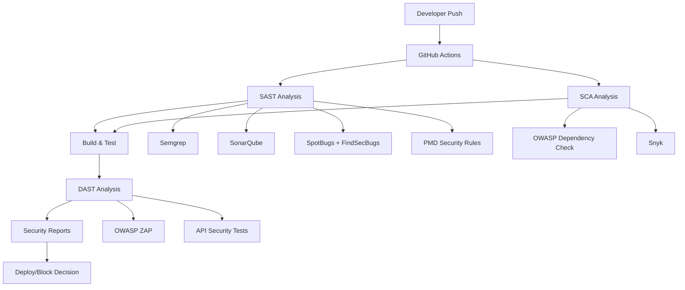

# Pipeline de Segurança CI/CD - BetAware API

## Visão Geral

Este documento descreve a implementação completa do pipeline de segurança automatizada para o projeto BetAware API, integrando ferramentas de SAST (Static Application Security Testing), DAST (Dynamic Application Security Testing) e SCA (Software Composition Analysis).

## Arquitetura de Segurança



## Ferramentas Implementadas

### 1. SAST (Static Application Security Testing)

#### 1.1 Semgrep
- **Objetivo**: Análise de código estático com regras personalizadas
- **Configuração**: `.semgrep/settings.yml` e `.semgrep/custom-rules.yml`
- **Detecta**:
  - Hardcoded secrets (JWT secrets, passwords)
  - SQL Injection patterns
  - XSS vulnerabilities
  - Weak password encoders
  - CORS misconfigurations
  - Debug logging exposure

#### 1.2 SonarQube/SonarCloud
- **Objetivo**: Análise abrangente de qualidade e segurança do código
- **Configuração**: `sonar-project.properties`
- **Detecta**:
  - Vulnerabilidades OWASP Top 10
  - Code smells de segurança
  - Duplicação de código
  - Cobertura de testes
  - Hotspots de segurança

#### 1.3 SpotBugs + FindSecBugs
- **Objetivo**: Detecção de bugs e vulnerabilidades em bytecode Java
- **Configuração**: `spotbugs-security-include.xml`
- **Detecta**:
  - SQL Injection
  - XSS
  - Path Traversal
  - Command Injection
  - Weak cryptography
  - XXE vulnerabilities

#### 1.4 PMD Security Rules
- **Objetivo**: Análise de padrões de código inseguros
- **Detecta**:
  - Padrões de segurança violados
  - Best practices não seguidas
  - Código propenso a erros

### 2. SCA (Software Composition Analysis)

#### 2.1 OWASP Dependency Check
- **Objetivo**: Verificação de vulnerabilidades conhecidas em dependências
- **Configuração**: Plugin Maven + `owasp-suppressions.xml`
- **Detecta**:
  - CVEs conhecidos
  - Versões desatualizadas
  - Dependências vulneráveis

#### 2.2 Snyk
- **Objetivo**: Análise avançada de dependências e licenças
- **Detecta**:
  - Vulnerabilidades em tempo real
  - Licenças incompatíveis
  - Sugestões de correção

### 3. DAST (Dynamic Application Security Testing)

#### 3.1 OWASP ZAP
- **Objetivo**: Teste de segurança em aplicação em execução
- **Configuração**: `.zap/rules.tsv` e `.zap/context.xml`
- **Detecta**:
  - Vulnerabilidades em tempo de execução
  - Falhas de autenticação
  - Configurações inseguras
  - OWASP Top 10 em runtime

#### 3.2 API Security Tests
- **Objetivo**: Testes específicos para APIs REST
- **Detecta**:
  - Authentication bypass
  - SQL Injection via API
  - XSS via API
  - Authorization flaws

## Pipeline CI/CD

### Fluxo do Pipeline

1. **Trigger**: Push/PR para branches main/master/develop
2. **SAST Analysis**: Execução paralela de todas as ferramentas SAST
3. **SCA Analysis**: Verificação de dependências e licenças
4. **Build & Test**: Compilação e testes unitários
5. **DAST Analysis**: Testes dinâmicos em aplicação em execução
6. **Security Report**: Consolidação de todos os relatórios
7. **Quality Gate**: Decisão de deploy baseada em critérios de segurança

### Quality Gates

#### Critérios de Bloqueio (Pipeline falha):
- Vulnerabilidades críticas encontradas no SAST
- CVEs críticos nas dependências
- Vulnerabilidades de alto risco no DAST
- Falha nos testes de segurança da API

#### Critérios de Warning:
- Vulnerabilidades de médio risco
- Code smells de segurança
- Dependências desatualizadas (não críticas)

### Configuração de Secrets

As seguintes secrets devem ser configuradas no GitHub:

```yaml
SONAR_TOKEN: # Token do SonarCloud
SONAR_ORGANIZATION: # Organização do SonarCloud
SNYK_TOKEN: # Token do Snyk
SEMGREP_APP_TOKEN: # Token do Semgrep (opcional)
```

## Execução Local

### Pré-requisitos
```bash
# Java 17
java -version

# Maven 3.8+
mvn -version

# Docker (para DAST)
docker -version
```

### SAST Local
```bash
# Semgrep
pip install semgrep
semgrep --config=.semgrep/settings.yml --config=.semgrep/custom-rules.yml

# SpotBugs + FindSecBugs
mvn spotbugs:check

# PMD
mvn pmd:check

# SonarQube (local)
mvn sonar:sonar -Dsonar.host.url=http://localhost:9000
```

### SCA Local
```bash
# OWASP Dependency Check
mvn dependency-check:check

# Snyk (requer token)
snyk test --file=pom.xml
```

### DAST Local
```bash
# Iniciar aplicação
mvn spring-boot:run

# OWASP ZAP (via Docker)
docker run -v $(pwd)/.zap:/zap/wrk/:rw \
  -t owasp/zap2docker-stable zap-baseline.py \
  -t http://host.docker.internal:8080 \
  -r zap-report.html
```

## Relatórios de Segurança

### Tipos de Relatórios Gerados

1. **SAST Reports**:
   - `target/spotbugs.xml` - SpotBugs findings
   - `target/pmd.xml` - PMD violations
   - `semgrep.sarif` - Semgrep results
   - SonarQube dashboard online

2. **SCA Reports**:
   - `target/dependency-check/` - OWASP Dependency Check
   - `snyk.sarif` - Snyk vulnerabilities

3. **DAST Reports**:
   - `zap-report.html` - ZAP baseline scan
   - `zap-report.xml` - ZAP XML results

4. **Consolidated Report**:
   - `security-reports/SECURITY_SUMMARY.md` - Resumo executivo

### Interpretação dos Resultados

#### Níveis de Severidade
- **CRITICAL**: Vulnerabilidades que devem ser corrigidas imediatamente
- **HIGH**: Vulnerabilidades importantes que requerem atenção
- **MEDIUM**: Vulnerabilidades que devem ser avaliadas
- **LOW**: Informacional, pode ser ignorado em alguns contextos

#### Métricas de Segurança
- **Security Hotspots**: Código que requer revisão manual
- **Vulnerabilities**: Falhas confirmadas de segurança
- **Code Smells**: Padrões que podem levar a problemas de segurança

## Configuração do Ambiente

### Desenvolvimento
```properties
# application-dev.properties
spring.h2.console.enabled=true
logging.level.org.springframework.security=DEBUG
spring.security.debug=true
```

### Teste
```properties
# application-test.properties
spring.h2.console.enabled=false
logging.level.org.springframework.security=WARN
```

### Produção
```properties
# application-prod.properties
spring.h2.console.enabled=false
logging.level.org.springframework.security=ERROR
server.ssl.enabled=true
security.headers.frame=DENY
```

## Correção de Vulnerabilidades

### Priorização
1. **CRITICAL/HIGH** SAST findings
2. **CRITICAL** CVEs em dependências
3. **HIGH** DAST vulnerabilities
4. **MEDIUM** issues com impacto no business

### Processo de Correção
1. Análise do finding
2. Verificação de falso positivo
3. Implementação da correção
4. Teste da correção
5. Verificação no pipeline
6. Deploy da correção

## Monitoramento Contínuo

### Alertas Automatizados
- Falhas no pipeline de segurança
- Novas vulnerabilidades descobertas
- Degradação das métricas de segurança

### Dashboard de Segurança
- SonarCloud: Visão geral da qualidade do código
- GitHub Security: SARIF reports e alertas
- Snyk Dashboard: Status das dependências

## Compliance e Governança

### Padrões Seguidos
- OWASP Top 10 2021
- SANS Top 25
- CWE (Common Weakness Enumeration)
- NIST Cybersecurity Framework

### Documentação de Compliance
- Evidências de testes de segurança
- Relatórios de correção de vulnerabilidades
- Logs de auditoria do pipeline

## Troubleshooting

### Problemas Comuns

#### Pipeline Falhando
```bash
# Verificar logs do GitHub Actions
# Analisar artifacts gerados
# Verificar configuração de secrets
```

#### Falsos Positivos
```bash
# Adicionar supressões nos arquivos de configuração
# Revisar regras das ferramentas
# Documentar justificativa
```

#### Performance do Pipeline
```bash
# Cache de dependências Maven
# Execução paralela de jobs
# Otimização de regras de análise
```

## Melhorias Futuras

### Roadmap de Segurança
1. **Integração com SIEM**: Envio de alertas para sistemas de monitoramento
2. **Testes de Penetração Automatizados**: Integração com ferramentas mais avançadas
3. **Security Champions Program**: Treinamento da equipe de desenvolvimento
4. **Threat Modeling**: Análise de ameaças específicas da aplicação
5. **Runtime Application Self-Protection (RASP)**: Proteção em tempo de execução

### Métricas Avançadas
- MTTR (Mean Time To Remediation) de vulnerabilidades
- Security Debt tracking
- Developer security training metrics
- False positive rate por ferramenta

---

**Documento gerado automaticamente pelo Pipeline de Segurança BetAware**  
**Última atualização**: $(date)  
**Versão**: 1.0